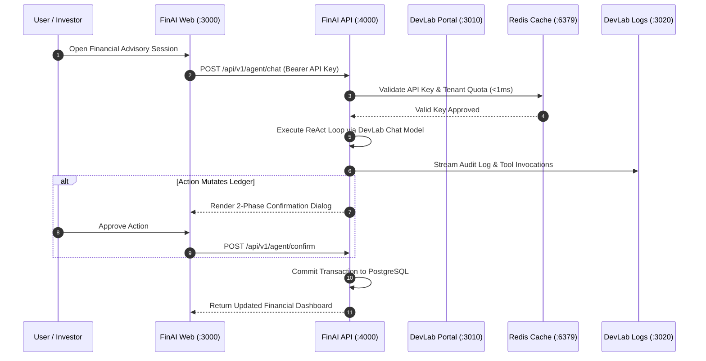

# FinAI — Product Specification, Technical Dossier & Operations Manual

---

## 1. Executive Product Dossier & Market Vision

### 1.1 The Operational Problem Space

In the digital personal and family finance space, existing platforms (Mint, YNAB, Monarch, Copilot) exhibit critical architectural shortcomings:

- **Passive History Displays**: Traditional apps show backward-looking pie charts and historical spend totals, but fail to provide proactive, forward-looking strategic advice.
- **Severe Privacy Vulnerabilities**: Cloud-based consumer fintech apps feed unmasked user bank balances, transaction histories, and net worth figures to third-party closed-source LLMs (OpenAI, Anthropic), creating severe data privacy and compliance risks.
- **The "Hallucinated Math" Trap**: When standard conversational AI bots calculate loan amortization, compound interest, or retirement horizons directly inside neural network attention weights, they hallucinate arithmetic figures, offering mathematically invalid financial advice.
- **Accidental State Mutation**: Unconstrained AI agents can trigger accidental bank transfers or delete budget categories without explicit user authorization or impact preview.

### 1.2 The FinAI Value Proposition

**FinAI** is an **Autonomous AI Financial Intelligence and Wealth Management Platform**:

1. **Privacy-Preserving Hybrid Intelligence**: Powered by Ollama local models and private DevLab Chat endpoints, guaranteeing that sensitive financial records never leak to public training sets.
2. **Deterministic, Zero-Hallucination Math Engine**: All financial calculations (net worth, cash flow, runway, budget adherence, Sharpe ratios, retirement Monte Carlo) are executed in `@finai/finance-engine`—a pure functional TypeScript library with **zero I/O, zero network, and zero side-effects**.
3. **Conversational ReAct Cognitive Advisory**: An AI advisor that retrieves verified ledger facts via read-only tools before synthesizing actionable recommendations.
4. **Mandatory 2-Phase Confirmation Protocol**: Any state-mutating operation (creating budgets, logging transactions, moving funds) requires interactive preview cards displaying the financial impact before user confirmation.
5. **Strict 2-File Feature Modal Pattern**: Standardizes frontend engineering across all financial features with decoupled presentation and mutation logic.

---

## 2. Exhaustive Feature Matrix & Deep Technical Explanation

```
┌────────────────────────────────────────────────────────────────────────────────────────┐
│                              FINAI PLATFORM ARCHITECTURE                               │
└────────────────────────────────────────────────────────────────────────────────────────┘
                 [Next.js 15 Web Dashboard (:3000)]
                                │  (React Query / REST)
                                ▼
                 [NestJS 11 Backend API (:4000)]
                                │
    ┌───────────────────────────┼───────────────────────────┐
    ▼                           ▼                           ▼
[1. Ledger Engine]      [2. AI ReAct Advisor]       [3. Finance Engine]
 • Accounts & Txns       • DevLab Chat / Ollama      • Pure Math (Zero-IO)
 • Double-Entry Ledger   • 2-Phase Write Rail        • Projections & Ratios
    │                           │                           │
    └───────────────────────────┼───────────────────────────┘
                                ▼
                 [PostgreSQL & Prisma 7 (:5432)]
```

### Feature 1: Multi-Account Net Worth & Ledger Tracker

- **Modules**: `apps/web/src/features/accounts/` & `apps/api/src/modules/account/`
- **Objective**: Consolidate bank accounts, credit cards, investment portfolios, and loans into an accurate real-time net worth balance.
- **How It Works**:
  - Double-entry ledger architecture where every transaction is associated with an account ID.
  - Balances are evaluated dynamically:
    $$\text{Net Worth} = \sum \text{Assets (Cash, Investments, Real Estate)} - \sum \text{Liabilities (Credit Cards, Loans, Mortgages)}$$
  - Enforces currency isolation with multi-currency conversion support.

### Feature 2: Transaction Categorization & Deduplication

- **Modules**: `apps/web/src/features/transactions/` & `apps/api/src/modules/transaction/`
- **Objective**: Ingest bank transaction feeds, eliminate duplicates, and automatically classify spend categories.
- **How It Works**:
  - Computes cryptographic hash fingerprints (`account_id + date + amount + payee`) to prevent duplicate transaction imports.
  - Categorizes expenses into standard buckets (Housing, Utilities, Groceries, Discretionary) using heuristic matching and local embedding similarity.

### Feature 3: Deterministic Financial Mathematics Engine

- **Module**: `packages/finance-engine/`
- **Objective**: Eliminate LLM hallucination by executing 100% of mathematical projections in pure TypeScript functions.
- **Core Algorithms**:
  - **Budget Adherence Score**: Computes variance ratios between budgeted allowances and actual spend, outputting a 0-100 adherence index.
  - **Emergency Fund Runway**: Calculates months of financial survival under complete income loss:
    $$\text{Runway (Months)} = \frac{\text{Liquid Cash Assets}}{\text{Average Monthly Non-Discretionary Spend}}$$
  - **Investment Sharpe Ratio & Volatility**: Evaluates risk-adjusted returns of stock/crypto holdings against the risk-free rate.
  - **Retirement Horizon**: Evaluates future portfolio values using compound interest and inflation adjustments.
- **Invariants**: ZERO dependencies, ZERO network calls, ZERO file I/O.

### Feature 4: Autonomous Conversational ReAct Advisor

- **Module**: `packages/ai-engine/` & `apps/api/src/modules/agent/`
- **Objective**: Conversational Socratic financial planner operating through a ReAct (Reason + Act) loop.
- **How It Works**:
  - The advisor ingests user prompts (e.g. "Can I afford to purchase a $45,000 car with financing?").
  - Invokes read-only tools against the database (`get_monthly_cashflow`, `get_net_worth`, `calculate_loan_amortization`).
  - Synthesizes personalized recommendations citing exact dollar figures and projected debt-to-income ratios.

### Feature 5: Two-Phase Mutating Safeguards

- **Module**: `packages/ai-engine/src/tools/` & `apps/web/src/features/advisor/`
- **Objective**: Guarantee that the AI advisor never mutates financial data without explicit user review.
- **How It Works**:
  - Phase 1 (Simulation): The AI synthesizes the planned action and emits a preview payload (e.g. "Create Budget: Dining Out = $400/mo").
  - The UI renders an interactive confirmation card detailing the balance delta.
  - Phase 2 (Execution): The user clicks "Approve", dispatching a cryptographically signed execution request to commit the change.

### Feature 6: Standardized 2-File Feature Modal Pattern

- **Module**: `apps/web/src/features/*/components/`
- **Objective**: Maintain clean architectural separation between UI presentation and React Query state logic.
- **Pattern**:
  - **`<Entity>Form.tsx`**: Pure presentational form component rendering accessible fields via `@finai/ui`. Contains zero API mutations.
  - **`<Entity>Dialog.tsx`**: Manages modal open/close state, handles Zod schema validation using `.safeParse()`, and dispatches TanStack React Query mutations with automated cache invalidation.

---

## 3. How FinAI Interacts with the Multi-Repo Ecosystem



### Detailed Ecosystem Interaction Matrix

| Ecosystem Member    | Direction | Protocol / Transport      | Data Payload / Contract                                                                                |
| :------------------ | :-------: | :------------------------ | :----------------------------------------------------------------------------------------------------- |
| **`devlab-portal`** |  Inbound  | Redis Pub/Sub & REST API  | Authenticates incoming client API keys and enforces sub-millisecond kill-switch revocations.           |
| **`devlab-logs`**   | Outbound  | HTTP POST (`:3020`)       | Streams structured audit events, agent reasoning tokens, and financial calculation logs.               |
| **`incidentai`**    |  Inbound  | Monorepo Workspace        | IncidentAI monitors database connection health and automatically fixes database pool timeouts.         |
| **`devlab-shared`** |  Static   | Internal npm package link | Consumes `@yuva-devlab/ui` design system components, `@yuva-devlab/tokens`, and `@yuva-devlab/logger`. |

---

## 4. Technical Guidelines & Invariants

### 4.1 Invariants & Quality Standards

1. **Hard 250-Line Maximum Rule**: Every file in `apps/api/src/`, `apps/web/src/`, and packages must remain strictly under 250 lines.
2. **Pure Finance Engine**: `@finai/finance-engine` must remain strictly functional: zero side-effects, zero I/O, zero database queries.
3. **Centralized Zod Validation**: ALL input schemas must reside in `@finai/validation` and use `.safeParse()`.
4. **2-File Feature Modal Pattern**: All entity forms must follow `<Entity>Form.tsx` (presentation) + `<Entity>Dialog.tsx` (state).
5. **Zero Magic Strings & Numbers**: Domain statuses (`active`, `pending`, `completed`) must use canonical enums from `@finai/shared-types`.

---

## 5. Complete Usage Runbook & Operations Manual

### 5.1 Installation & Setup

```bash
# Clone the repository
git clone https://github.com/yuvadevlab/fin-ai.git finai
cd finai

# Install dependencies via pnpm
pnpm install

# Run database migrations and generate Prisma client
pnpm db:generate
pnpm db:migrate

# Start Web and API applications concurrently
pnpm dev
```

### 5.2 Environment Variables Reference

| Variable              | Type   | Default                  | Description                                          |
| :-------------------- | :----- | :----------------------- | :--------------------------------------------------- |
| `PORT`                | Number | `4000`                   | HTTP port for NestJS Backend API.                    |
| `DATABASE_URL`        | String | Required                 | PostgreSQL connection URL with public schema.        |
| `REDIS_URL`           | String | `redis://localhost:6379` | Redis connection URL for caching and rate limiting.  |
| `OLLAMA_BASE_URL`     | String | `http://localhost:11434` | Ollama model server endpoint for local AI inference. |
| `NEXT_PUBLIC_API_URL` | String | `http://localhost:4000`  | Backend API URL consumed by the web console.         |
| `DEVLAB_LOGS_URL`     | String | `http://localhost:3020`  | Telemetry endpoint for streaming structured logs.    |
