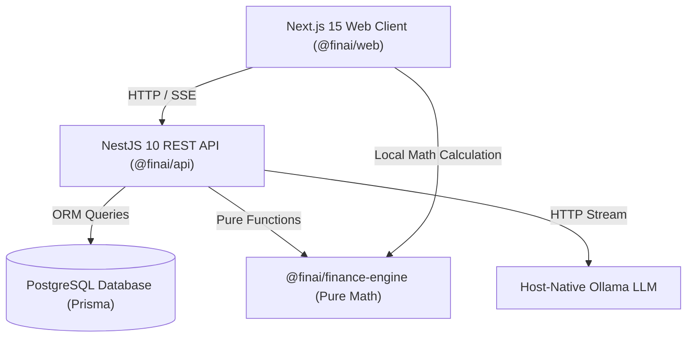

# FinAI — Master Technical & Product Architecture Documentation

Welcome to the official **FinAI Architecture & Product Documentation Suite**. This documentation is designed for software engineers, product managers, system architects, and technical contributors to completely understand the codebase, data models, API endpoints, mathematical calculation engines, UI components, and AI workflows.

---

## Workspace Coding Standards & Agent Guidelines (`.agents/AGENTS.md`)

Before contributing code to FinAI, review the official [**`FinAI Agent & Coding Guidelines`**](../.agents/AGENTS.md):

1. **Monorepo Package Boundaries**: `@finai/finance-engine` MUST contain **zero side-effects and zero I/O**.
2. **2-File Feature Modal Standard**: Every data entry modal MUST follow the 2-file pattern:
   - `<Entity>Form.tsx`: Pure form presentation component utilizing `<FormDialogField />`.
   - `<Entity>Dialog.tsx`: Modal wrapper, Zod `safeParse()` validation, field error mapping, and React Query mutation.
3. **Zod Validation**: ALL schemas MUST reside in `@finai/validation` and use `.safeParse()`.
4. **State Management**: Feature API hooks under `src/features/<feature>/api/` using `@tanstack/react-query` with automatic `queryClient.invalidateQueries()` on mutations.
5. **Styling & UI**: Exclusively use TailwindCSS semantic tokens (`bg-card`, `bg-background`, `border-border`, `text-destructive`) and Lucide icons.

---

## Documentation Map

This suite is organized into modular, deep-dive guides:

| Document                                                                                            | Topic                            | Description                                                                                                                                                                                                               |
| :-------------------------------------------------------------------------------------------------- | :------------------------------- | :------------------------------------------------------------------------------------------------------------------------------------------------------------------------------------------------------------------------ |
| 📄 [01_MONOREPO_AND_PACKAGES.md](01_MONOREPO_AND_PACKAGES.md)                                       | **Monorepo & Shared Packages**   | Monorepo structure, package boundaries, `@finai/finance-engine` math formulas, `@finai/ui` primitives, `@finai/validation` Zod schemas, and Prisma schema.                                                                |
| 📄 [02_LAYOUT_SHELL_AND_HEADER.md](02_LAYOUT_SHELL_AND_HEADER.md)                                   | **Layout Shell & Headers**       | `DashboardShell`, `TopBar`, `ProfileMenu` profile sync, `WorkspaceMenu`, `SearchDropdown`, `NotificationsMenu`, and `AppearanceProvider`.                                                                                 |
| 📄 [03_DASHBOARD_MODULE.md](03_DASHBOARD_MODULE.md)                                                 | **Dashboard Module**             | `/dashboard` architecture, KPI Stat Cards, Cash Flow line/bar chart, Financial Health Score formula, and Live AI Insights.                                                                                                |
| 📄 [04_TRANSACTIONS_MODULE.md](04_TRANSACTIONS_MODULE.md)                                           | **Transactions Ledger**          | `/transactions` architecture, server-side search, `DataTable`, custom `Pagination` component (`page`, `pageSize`, per-page selector, "n of n"), and `TransactionDialog`.                                                  |
| 📄 [05_BUDGETS_AND_EXPENSES_MODULE.md](05_BUDGETS_AND_EXPENSES_MODULE.md)                           | **Budgets & Expense Limits**     | `/budgets` architecture, `BudgetCard` color status indicators, remaining balance math, and `BudgetDialog`.                                                                                                                |
| 📄 [06_INVESTMENTS_PORTFOLIO_MODULE.md](06_INVESTMENTS_PORTFOLIO_MODULE.md)                         | **Investments Portfolio**        | `/investments` architecture, 9 asset classes, `CategoryPie`, unrealized P&L math, holdings table, and `InvestmentDialog`.                                                                                                 |
| 📄 [07_GOALS_SAVINGS_MODULE.md](07_GOALS_SAVINGS_MODULE.md)                                         | **Savings Goals**                | `/goals` architecture, personal vs family goals (`GoalType`), completion date projection logic, `ProgressCard`, and `ContributeDialog`.                                                                                   |
| 📄 [08_REPORTS_AND_ANALYTICS_MODULE.md](08_REPORTS_AND_ANALYTICS_MODULE.md)                         | **Financial Reports**            | `/reports` architecture, income vs expense comparison, category breakdown pie, and monthly report API aggregation.                                                                                                        |
| 📄 [09_FAMILY_WORKSPACE_MODULE.md](09_FAMILY_WORKSPACE_MODULE.md)                                   | **Family Workspace**             | `/family` architecture, shared family member access control (`WorkspaceMember` roles), invitation token workflow (`WorkspaceInvite`), and joint goals.                                                                    |
| 📄 [10_AI_ADVISOR_AND_LLM_ENGINE.md](10_AI_ADVISOR_AND_LLM_ENGINE.md)                               | **AI Advisor & LLM Engine**      | `/ai-advisor` architecture, NestJS SSE streaming, Ollama LLM integration, Chat History persistence in PostgreSQL, GFM tables with `remark-gfm`, 1-click follow-up buttons, relative timestamps, and AI scope enforcement. |
| 📄 [11_SETTINGS_AND_PREFERENCES.md](11_SETTINGS_AND_PREFERENCES.md)                                 | **Settings & Preferences**       | `/settings` architecture, environment feature flag filtering (`SETTING_FLAGS`), section deep-linking query parameters (`/settings?section=*`), 2-file feature pattern, and theme/density switcher.                        |
| 📄 [12_SYSTEM_ARCHITECTURE_IMPROVEMENTS_ROADMAP.md](12_SYSTEM_ARCHITECTURE_IMPROVEMENTS_ROADMAP.md) | **Architecture Audit & Roadmap** | Potential bottlenecks ("path holes"), microservices splitting strategy, database scaling, performance optimizations, and feature roadmap.                                                                                 |

---

## End-to-End High-Level System Architecture



---

## Developer Quick Start Guide

### 1. Requirements

- **Node.js**: `v24.x` or `v22.x`
- **pnpm**: `v10.x` or `v11.x`
- **PostgreSQL**: `v15+`
- **Ollama LLM**: Host-native Ollama running `qwen3:8b` or `llama3`

### 2. Setup Commands

```bash
# Install all dependencies across workspace
pnpm install

# Push database schema to PostgreSQL
pnpm --filter @finai/database db:push

# Seed initial categories & demo data
pnpm --filter @finai/api seed

# Start API backend (NestJS on port 4000)
pnpm --filter @finai/api dev

# Start Web frontend (Next.js on port 3000)
pnpm --filter @finai/web dev
```

### 3. Verification Commands

```bash
# Typecheck all TypeScript code
pnpm --filter @finai/web typecheck

# Build shared packages
pnpm --filter @finai/ui build

# Run linting across entire monorepo
pnpm lint
```
