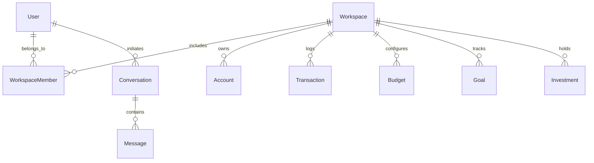

# 01 — Monorepo Architecture & Shared Packages

This document details the monorepo package boundaries, build pipelines, and mathematical / validation specifications of **FinAI**.

---

## 1. Monorepo Package Structure

FinAI uses **pnpm workspaces** and **Turborepo** to structure code into modular, type-safe packages:

```text
packages/
├── finance-engine/          # Pure mathematical calculation engine (zero I/O, zero side-effects)
├── ui/                      # Shared React UI components & Radix UI primitives
├── validation/              # Centralized Zod validation schemas
├── shared-types/            # Shared DTOs, TypeScript interfaces, and Enums
├── database/                # Prisma ORM schema & client provider
└── logger/                  # Universal Winston logger wrapper
```

---

## 2. Financial Math Engine (`@finai/finance-engine`)

The `@finai/finance-engine` package is a pure mathematical function library with **zero external dependencies and zero side-effects**. It runs identically on both Node.js (NestJS API) and the Browser (Next.js client).

### Key Functions & Formulas

#### A. `formatINR(amount: number): string`

- **Purpose**: Formats any numeric value into standard Indian numbering currency format.
- **Example**: `formatINR(100000)` ──> `"₹1,00,000"`.

#### B. `calculateNetWorth(accounts: Account[], investments: Investment[]): number`

- **Formula**: `\text{Net Worth} = \sum (\text{Account.balance}) + \sum (\text{Investment.currentValue})`
- **Inputs**: Array of active bank/wallet accounts and investment holdings.

#### C. `calculateNetCashFlow(income: number, expenses: number): number`

- **Formula**: `\text{Net Cash Flow} = \text{Total Income} - \text{Total Expenses}`

#### D. `calculateSavingsRate(income: number, expenses: number): number`

- **Formula**: `\text{Savings Rate \%} = \frac{\text{Income} - \text{Expenses}}{\text{Income}} \times 100`
- **Safety**: Returns `0` if `income <= 0`.

#### E. `calculateBudgetUsage(spent: number, limit: number)`

- **Formula**: `\text{Usage \%} = \frac{\text{Spent}}{\text{Limit}} \times 100`
- **Returns**: `{ usagePercentage: number, remaining: number, isExceeded: boolean }`.

#### F. `calculateHealthScore(metrics: HealthMetrics): number`

- **Range**: `0` to `100`.
- **Weighted Formula**:
  $$\text{Health Score} = 0.30 \times \text{SavingsScore} + 0.30 \times \text{LiquidityScore} + 0.20 \times \text{BudgetScore} + 0.20 \times \text{DiversificationScore}$$

#### G. `calculateAssetAllocation(investments: Investment[])`

- **Purpose**: Groups investments by `AssetClass` (`MUTUAL_FUND`, `STOCK`, `GOLD`, `FIXED_DEPOSIT`, `EPF`, `PPF`, `REAL_ESTATE`, `CRYPTO`, `OTHER`) and calculates portfolio percentages.

---

## 3. UI Component Library (`@finai/ui`)

Built with Radix UI, TailwindCSS v4, and Lucide Icons.

### Key Custom Components

- **`PageContainer`**: Max-width content wrapper with responsive padding.
- **`PageHeader`**: Standard title, description, and action button container.
- **`DataTable`**: Generic table component supporting custom columns, click listeners, and pagination embedding.
- **`Pagination`**: Custom pagination component supporting:
  - **Prev / Next**: Navigation buttons with boundary disabled states.
  - **Per Page Selector**: Select dropdown for page limits (`5`, `10`, `20`, `50`).
  - **"n of n" Display**: Displays `Page X of Y` and `Showing A–B of C items`.
- **`FormDialog` & `FormDialogField`**: Standardized form modal primitives for 2-file feature pattern modals.

---

## 4. Validation Layer (`@finai/validation`)

All form submissions and API DTOs are validated using centralized Zod schemas:

```ts
import { z } from "zod";

export const createTransactionSchema = z.object({
  amount: z.number().positive("Amount must be greater than 0"),
  date: z.string().min(1, "Date is required"),
  categoryId: z.string().min(1, "Category is required"),
  accountId: z.string().min(1, "Account is required"),
  toAccountId: z.string().optional(),
  type: z.enum(["INCOME", "EXPENSE", "TRANSFER", "INVESTMENT"]),
  notes: z.string().max(255).optional(),
});

export type CreateTransactionInput = z.infer<typeof createTransactionSchema>;
```

### Standard Validation Execution Pattern

```ts
const parseResult = schema.safeParse(input);
if (!parseResult.success) {
  const errors: Record<string, string> = {};
  parseResult.error.issues.forEach((issue) => {
    errors[issue.path[0] as string] = issue.message;
  });
  setErrors(errors);
}
```

---

## 5. Database Schema (`@finai/database`)

The PostgreSQL schema is managed via Prisma ORM (`schema.prisma`):



### Key Models & Indexes

- **`User`**: `id`, `email`, `name`, `passwordHash`, `preferences` (JSON column storing appearance & notifications).
- **`Workspace`**: `id`, `name`, `type` (`PERSONAL`, `FAMILY`), `ownerId`.
- **`Transaction`**: `id`, `workspaceId`, `accountId`, `categoryId`, `amount`, `date`, `type`. Indexed on `[workspaceId]`, `[accountId]`, `[categoryId]`, `[date]`.
- **`Conversation` & `Message`**: AI Advisor session persistence. Indexed on `[userId]`, `[workspaceId]`, `[conversationId]`.
