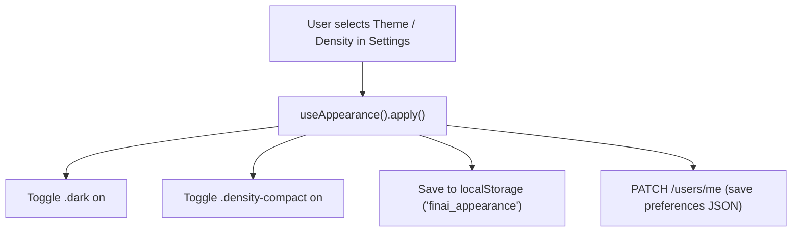

# 02 — Layout Shell, Header & TopBar System

This document describes the universal layout shell, topbar components, profile synchronization logic, workspace switcher, and DOM appearance context in **FinAI**.

---

## 1. Overall Shell Structure (`DashboardShell.tsx`)

Every authenticated view in `@finai/web` is wrapped inside `DashboardShell`.

```tsx
export function DashboardShell({ children }: { children: React.ReactNode }) {
  return (
    <>
      <AppearanceSync />
      <AppShell sidebar={<Sidebar />} topbar={<TopBar />}>
        {/* Global Search Dropdown Overlay */}
        {searchQuery && <SearchDropdown />}
        {children}
      </AppShell>
    </>
  );
}
```

---

## 2. TopBar Components

### 2.1 ProfileMenu (`ProfileMenu.tsx`)

- **Product Purpose**: Displays user avatar, profile details, theme preferences, and sign-out trigger.

#### Technical Implementation & Data Flow

1. **User Synchronization**: Uses `useSyncExternalStore` reading `localStorage.getItem("finai_user")` combined with React Query's `useProfile()` API hook (`GET /users/me`).
2. **Initials Fallback Generator**:
   ```ts
   function getInitials(name?: string, email?: string): string {
     if (name) {
       const parts = name.trim().split(/\s+/);
       if (parts.length >= 2) return `${parts[0][0]}${parts[1][0]}`.toUpperCase();
       return name.slice(0, 2).toUpperCase();
     }
     if (email) return email.slice(0, 2).toUpperCase();
     return "AS";
   }
   ```
3. **Section Deep-Link Navigation**:
   - `Profile`: `/settings?section=profile`
   - `Appearance`: `/settings?section=appearance`
   - `Security`: `/settings?section=security`
   - `All Settings`: `/settings`
4. **Sign Out Handler**:
   - Clears `finai_token`, `finai_user`, and `finai_workspace_id` from `localStorage`.
   - Expires auth cookies (`document.cookie = "finai_token=; expires=..."`).
   - Redirects user to `/login`.

---

### 2.2 WorkspaceMenu (`WorkspaceMenu.tsx`)

- **Product Purpose**: Switches active workspace between Personal and Family spaces.
- **API Endpoint**: `GET /workspaces`
- **State Logic**: Updates `useWorkspace()` context. Changes React Query `workspaceId` key, causing all active queries (`transactions`, `budgets`, `goals`, `investments`) to instantly re-fetch for the selected workspace.

---

### 2.3 SearchBar & SearchDropdown (`SearchDropdown.tsx`)

- **Product Purpose**: Global search overlay across transactions, accounts, categories, and goals.
- **API Endpoint**: `GET /workspaces/:id/search?q=:query`
- **Debounce**: 300ms input debounce.
- **Display**: Categorized dropdown floating over content. Clicking a result navigates directly to the entity.

---

## 3. DOM Appearance Provider (`AppearanceProvider.tsx`)

Manages client-side theme and density customization.



### Modes Supported

1. **Theme**:
   - `Light`: Removes `.dark` class from `<html>`.
   - `Dark`: Adds `.dark` class to `<html>`.
   - `System`: Listens to `window.matchMedia("(prefers-color-scheme: dark)")` and updates dynamically.
2. **Density**:
   - `Comfortable`: Standard padding (`p-5`, `p-4`, `space-y-4`).
   - `Compact`: Applies `.density-compact` to `<body>`, scaling down CSS padding variables (`--spacing-scale: 0.75`).
