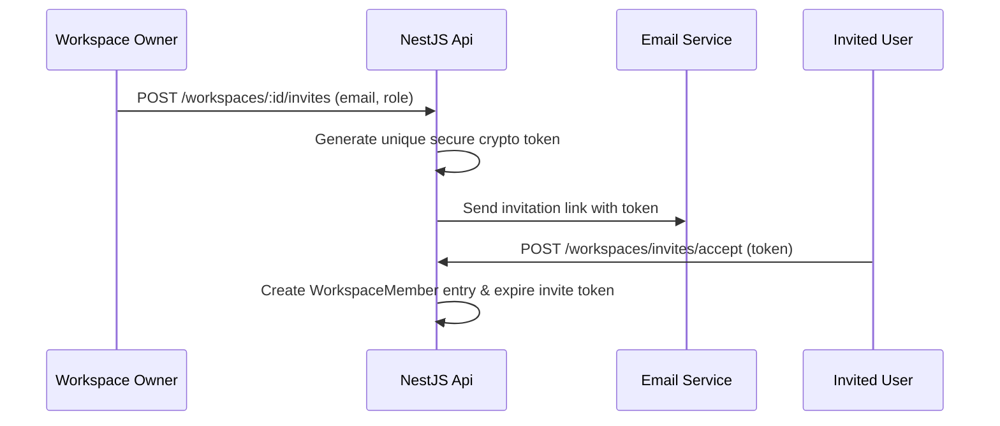

# 09 — Family Workspace Module Specification

This document details the **Family Workspace Page (`/family`)**, shared member roles, email invitation workflows, and joint household budgeting.

---

## 1. Product Requirements & Overview

Family Workspaces (`WorkspaceType: FAMILY`) allow multiple users to pool financial data, manage shared household budgets, track joint savings goals, and assign access permissions (`OWNER`, `ADMIN`, `MEMBER`).

---

## 2. Invitation & Member Role Workflow



---

## 3. Component Structure

```text
src/features/family/components/
├── FamilyPage.tsx             # Main family workspace overview
├── FamilyMemberList.tsx       # Member list with role badges and remove action
├── InviteMemberDialog.tsx     # Modal for sending email invitations
└── LiveAIInsightCard.tsx      # page="family" shared savings insights
```

---

## 4. API Routes

- **Fetch Members**: `GET /workspaces/:id/members`
- **Send Invite**: `POST /workspaces/:id/invites`
- **Accept Invite**: `POST /workspaces/invites/accept`
- **AI Insight**: `GET /ai/insight?workspaceId=:id&page=family`
