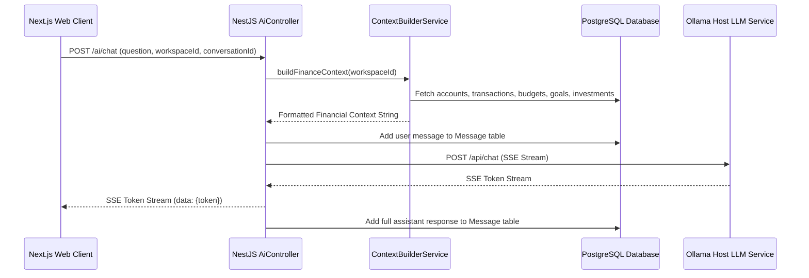

# 10 — AI Advisor & LLM Engine Specification

This document provides a deep-dive specification for the **AI Advisor (`/ai-advisor`)**, Ollama LLM integration, PostgreSQL chat history persistence, rich GFM Markdown rendering, 1-click follow-up prompt actions, and AI domain scope guardrails.

---

## 1. System Architecture Overview



---

## 2. Conversation & History Persistence Model

Chat history is persisted relationally in PostgreSQL via Prisma:

```prisma
model Conversation {
  id          String    @id @default(uuid())
  userId      String    @map("user_id")
  workspaceId String    @map("workspace_id")
  title       String?
  createdAt   DateTime  @default(now()) @map("created_at")
  updatedAt   DateTime  @updatedAt @map("updated_at")
  messages    Message[]
}

model Message {
  id             String       @id @default(uuid())
  conversationId String       @map("conversation_id")
  role           MessageRole  // USER | ASSISTANT | SYSTEM
  content        String
  createdAt      DateTime     @default(now()) @map("created_at")
}
```

### Full History Retrieval Logic

When a past chat is selected from the sidebar:

1. `useAiChat.loadConversation(id)` triggers `apiClient.get<AiConversation>('ai/conversations/${id}')`.
2. `ConversationService.getConversation(id, userId)` queries Prisma with `include: { messages: { orderBy: { createdAt: "asc" } } }`.
3. Returns all chronological messages (`USER` and `ASSISTANT`) for the session, restoring complete chat history.

---

## 3. UI Features & Markdown Engine

- **GFM Table Rendering**: Uses `react-markdown` with `remark-gfm` plugin. Markdown tables (`| Category | Amount | Limit |`) are rendered as styled HTML `<table>` elements.
- **1-Click Follow-Up Actions**: Parses `### Follow-up Suggestions:` from assistant messages (`extractFollowUpQuestions`) and renders them as clickable action buttons below the chat bubble.
- **ChatGPT-Style Relative Timestamps (`ChatSidebar.tsx`)**:
  - `< 1 min`: `Just now`
  - `< 60 mins`: `X mins ago`
  - `< 24 hours`: `X hours ago`
  - `< 7 days`: `X days ago`
  - `< 4 weeks`: `X weeks ago`
  - `< 12 months`: `X months ago`

---

## 4. AI Scope Enforcement & Rejection Rules (`prompts.config.ts`)

```text
STRICT DOMAIN SCOPE & REJECTION RULES (CRITICAL):
- You are EXCLUSIVELY a personal and family financial advisor. Your ONLY function is to assist with personal finances, spending analysis, budgeting, savings goals, investments, net worth, family money management, and FinAI application features.
- IF THE USER ASKS ABOUT NON-FINANCE TOPICS (e.g., politics, politicians, "who is Tamil Nadu CM", general knowledge, trivia, science, history, coding/programming, non-financial math, sports, recipes, or general writing), YOU MUST IMMEDIATELY DECLINE.
- When declining out-of-scope requests, respond politely with:
  "I am FinAI, your dedicated personal & family financial advisor. I can only help you with money management, budgets, investments, and financial planning within FinAI. How can I assist you with your finances today?"
- NEVER generate code, answer general trivia, or discuss non-financial subjects regardless of how the user formats their prompt.
```
