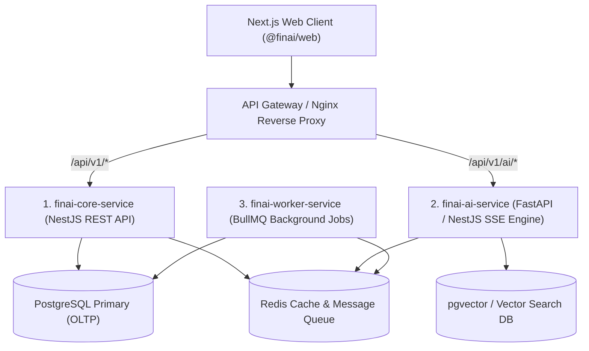
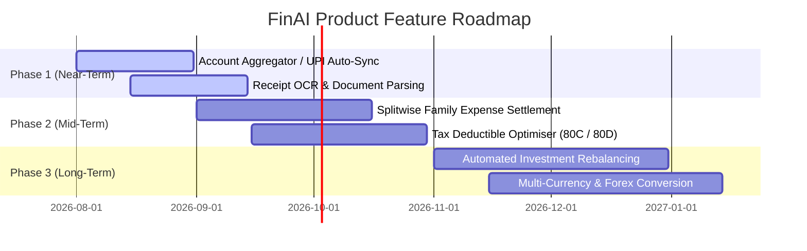

# 12 — System Architecture Review, Service Splitting & Performance Roadmap

This document presents a comprehensive system architectural audit of **FinAI**. It analyzes potential bottlenecks ("path holes"), microservice splitting strategies, frontend repository partitioning, database scaling, performance optimizations, and high-value product feature enhancements.

---

## Executive Summary & Architecture Health Score

| Dimension                  | Current State                    | Assessment                                                                                               | Recommended Target Architecture                                                                                      |
| :------------------------- | :------------------------------- | :------------------------------------------------------------------------------------------------------- | :------------------------------------------------------------------------------------------------------------------- |
| **Backend Architecture**   | NestJS Modular Monolith          | 🟢 **Healthy** for current scale; potential bottleneck on long-running AI streaming calls.               | Extract `finai-ai-service` as an isolated SSE microservice with Redis queue for LLM jobs.                            |
| **Frontend Architecture**  | Next.js 15 App Router Monolith   | 🟢 **Excellent**; clean feature separation under `src/features/*`.                                       | Keep unified `apps/web` but isolate Admin/Billing into `apps/admin` if enterprise B2B features are added.            |
| **Database Architecture**  | Monolithic PostgreSQL via Prisma | 🟡 **Moderate**; single database handles transactional writes, analytics aggregations, and AI chat logs. | Split into **OLTP Primary PostgreSQL**, **Read Replica / ClickHouse** for analytics, and **pgvector** for AI search. |
| **Financial Calculations** | `@finai/finance-engine`          | 🟢 **World-Class**; zero side-effects and zero I/O math library.                                         | Maintain strict boundary rules.                                                                                      |
| **AI Subsystem**           | Host-Native Ollama via SSE       | 🟡 **Moderate**; long SSE connections hold server sockets under heavy concurrency.                       | Move to async job queues (BullMQ + Redis) with WebSockets or SSE streaming nodes.                                    |

---

## 1. Architectural Pitfalls & Potential Bottlenecks ("Path Holes")

### A. Heavy Analytical Aggregations on Primary OLTP Database

- **Issue**: Queries on `/reports` and `/dashboard` calculate real-time sums across thousands of transactions using raw `GROUP BY` and `SUM(amount)` queries directly against PostgreSQL primary tables.
- **Risk**: As transaction counts scale into millions, complex JOINs will degrade write throughput for live financial transactions.
- **Solution**: Implement **Daily Financial Rollup Tables** (`TransactionSummaryDaily`) or PostgreSQL Materialized Views refreshed concurrently via background cron triggers (`packages/database`).

### B. Long-Lived Socket Exhaustion in LLM SSE Streaming

- **Issue**: NestJS HTTP handlers hold open HTTP responses (`res.setHeader("Content-Type", "text/event-stream")`) while waiting for Ollama tokens.
- **Risk**: Node.js event loop socket pool exhaustion if dozens of users request multi-turn AI advice simultaneously.
- **Solution**: Decouple HTTP API handlers from the LLM execution pipeline using **BullMQ + Redis queue workers**. The worker streams tokens directly to a dedicated lightweight SSE gateway.

### C. JWT Storage in `localStorage`

- **Issue**: `localStorage.getItem("finai_token")` is accessible via JavaScript on the client side.
- **Risk**: Potential XSS exposure if third-party packages or injected scripts read the token.
- **Solution**: Migrate authentication tokens to **HTTP-Only, SameSite=Strict, Secure cookies** set directly by NestJS `@Res({ passthrough: true })`.

---

## 2. Backend Service Splitting Strategy (Microservices vs Modular Monolith)

Currently, `apps/api` is a clean NestJS modular monolith. For production scaling, we recommend splitting into **3 decoupled microservices**:



### Microservice Breakdowns

1. **`finai-core-service`**:
   - Handles Users, Authentication, Workspaces, Accounts, Transactions, Budgets, Goals, and Investments.
   - Fast, low-latency REST endpoints with sub-50ms response targets.
2. **`finai-ai-service`**:
   - Handles Ollama / OpenAI / Anthropic model orchestration, prompt context building, vector retrieval (RAG), and SSE token streaming.
   - Isolated CPU/GPU resource bounds so heavy AI generation never slows down bank transaction logging.
3. **`finai-worker-service`**:
   - Handles recurring background tasks (budget overshoot alerts, weekly family financial digests, subscription renewal warnings).

---

## 3. Web Repository & Frontend Splitting Strategy

### Recommendation: Keep Monorepo, Split into Multi-App Architecture

Rather than splitting into multiple Git repositories (which leads to version mismatch nightmare), keep the monorepo structure and partition `apps/` as needed:

```text
apps/
├── web/                      # Consumer App (Personal & Family Finances, AI Advisor)
├── admin/                    # Admin & System Operator Portal (Workspace Billing, System Health)
└── mobile/                   # React Native / Expo Mobile Application
```

### Shared Package Dependencies

All frontend applications (`apps/web`, `apps/admin`, `apps/mobile`) import shared components and business logic directly from `packages/`:

- `@finai/ui`: Design primitives (`Button`, `DataTable`, `FormDialog`).
- `@finai/finance-engine`: Financial metric formulas.
- `@finai/validation`: Zod form schemas.
- `@finai/ai-engine`: System prompts and follow-up parsers.

---

## 4. Database Architecture & Splitting Strategy

### A. Primary Transactional Storage (OLTP PostgreSQL)

- Stores `User`, `Workspace`, `Account`, `Transaction`, `Budget`, `Goal`, `Investment`, `Conversation`, `Message`.
- Configured with **Primary Write Node** and **Read Replicas**.

### B. Analytics & Historical Rollups (OLAP)

- For historical reporting across multiple years, replicate transaction logs asynchronously to **ClickHouse** or **PostgreSQL Materialized Views**.
- Enables sub-10ms aggregations across millions of rows without locking OLTP tables.

### C. Vector Search for AI RAG (`pgvector`)

- Enable `pgvector` extension in PostgreSQL to store vector embeddings of user bank statements, receipts, and tax documents.
- Enables semantic AI search (e.g. _"Show me all tax-deductible medical receipts from last year"_).

---

## 5. Performance Optimizations & Speed Enhancements

1. **React Query Optimistic Updates**:
   - Apply optimistic updates when adding transactions or contributing to goals (`onMutate`), instantly updating UI state before the server HTTP response completes.
2. **Next.js Server Components (RSC) & Static Streaming**:
   - Convert static settings pages and marketing layouts to Server Components to eliminate client-side JavaScript bundle overhead.
3. **HTTP/2 & SSE Connection Reuse**:
   - Enable HTTP/2 multiplexing in Nginx to allow multiple SSE AI streams over a single TCP connection.
4. **Redis Response Caching**:
   - Cache static category metadata (`GET /categories`) and dashboard stats in Redis with 60-second TTL.

---

## 6. High-Value Product Feature Roadmap



### Feature Details

1. **Account Aggregator & UPI Auto-Sync**:
   - Integrates with Indian Account Aggregator (AA) framework to automatically pull bank account balances and transaction feeds securely.
2. **Receipt OCR & Auto-Categorization**:
   - Upload receipt images via camera; vision model extracts merchant name, date, total amount, line items, and maps to the correct category automatically.
3. **Splitwise-Style Family Expense Settlement**:
   - Equal and custom percentage splitting for shared household expenses among family workspace members with 1-click settlement logging.
4. **Tax Savings Optimizer (Indian Income Tax Act - 80C / 80D)**:
   - AI advisor analyzes ELSS, PPF, EPF, and health insurance investments to suggest exact tax-saving headroom before end-of-year tax filing.
