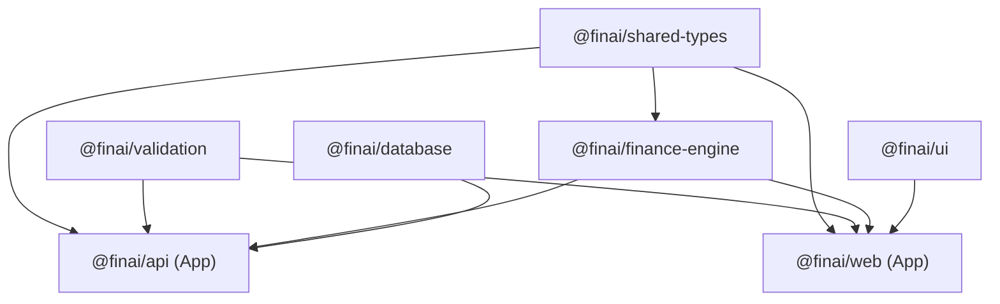

# FinAI Production Infrastructure & DevOps Engineering Master Guide

Welcome to the definitive DevOps engineering, infrastructure architecture, containerization, reverse proxying, automation, security hardening, and disaster recovery manual for the **FinAI** pnpm monorepo.

This manual serves as both an enterprise production blueprint and a comprehensive learning course. It is tailored specifically to hosting the application on a **Windows Server** host at the fixed directory path:

```text
D:\server\repos\fin-ai
```

---

## Host Directory Map (`D:\server\`)

```text
D:\
└── server\
    ├── repos\
    │   └── fin-ai\                  # Application Source Repository
    │       ├── apps\                # Next.js frontend & NestJS API
    │       ├── packages\            # Workspace packages (db, ui, finance-engine, etc.)
    │       ├── docker\              # Container Dockerfiles & Nginx configs
    │       ├── .github\             # CI/CD Workflows (build.yml, deploy.yml)
    │       ├── scripts\             # PowerShell deployment, backup & restore scripts
    │       ├── docker-compose.yml   # Multi-container orchestration
    │       ├── package.json
    │       ├── pnpm-workspace.yaml
    │       ├── turbo.json
    │       ├── .env
    │       └── .env.example
    │
    ├── docker-data\                 # Persistent Container State
    │   ├── postgres\                # Host-mounted PostgreSQL data
    │   ├── nginx\                   # Host-mounted SSL/TLS certificates
    │   └── certbot\                 # ACME challenge tokens
    │
    ├── storage\                     # Persistent User & Engine Storage
    │   ├── uploads\                 # User uploaded document attachments
    │   └── exports\                 # Generated CSV/PDF financial reports
    │
    ├── logs\                        # Host Log Aggregation Directory
    │   ├── nginx\                   # Web server access & error logs
    │   ├── api\                     # NestJS application & error logs
    │   └── web\                     # Next.js server component logs
    │
    └── backups\                     # Automated Storage & Database Backups
        ├── postgres\                # Compressed .sql.zip database dumps
        ├── uploads\                 # Upload directory zips
        └── configs\                 # Environment & stack configuration backups
```

---

## Directory Purpose Rationale

1. **`D:\server\repos\fin-ai`**: Dedicated workspace for application source code, container definitions, and repository scripts. Isolated from runtime application data to allow seamless git operations (`git pull`, `git checkout`).
2. **`D:\server\docker-data`**: Holds persistent state managed by containers (e.g., PostgreSQL database tables, SSL certificates). Stored outside the git repository so git clean operations or pull actions never delete persistent data.
3. **`D:\server\storage`**: Centralized storage for runtime assets generated by users or background tasks. Mounted into container filesystems (`/app/uploads`).
4. **`D:\server\logs`**: Host-level log aggregation folder. Mounts container log paths to allow host tools (e.g., log forwarding agents, PowerShell scripts) to inspect logs without needing `docker exec`.
5. **`D:\server\backups`**: Isolated location for point-in-time database dumps and storage zip archives. Preserved across host reboots and container re-creations.

---

# Module 1 — Repository Analysis

### 1. Theory

A modern JavaScript/TypeScript monorepo uses workspace management tools (such as **pnpm workspaces**) and build orchestrators (such as **Turbo**) to manage multiple interdependent applications and packages in a single repository.

Key characteristics of this monorepo layout:

- **`apps/api`**: NestJS backend providing REST/GraphQL APIs, Prisma ORM database access, and LLM integrations.
- **`apps/web`**: Next.js 15 App Router frontend consuming NestJS APIs and `@finai/ui` component library.
- **`packages/database`**: Prisma schema definitions, Prisma Client generation, database migrations, and seed scripts.
- **`packages/finance-engine`**: Financial calculations, compound interest, budget analytics logic.
- **`packages/shared-types`**: TypeScript interfaces and types shared across client and server.
- **`packages/ui`**: React component library built with TailwindCSS, Radix UI primitives, and Lucide icons.
- **`packages/validation`**: Zod schemas for input validation across Web and API boundaries.

### 2. Dependency Graph & Build Order



### 3. Production Requirements & Monorepo Optimization

- **Next.js Standalone Mode**: Enabled in `apps/web/next.config.ts` via `output: "standalone"`. This instructs Next.js during `next build` to analyze module imports and output a self-contained server bundle in `.next/standalone`, reducing Docker container size from >1GB to ~150MB.
- **Prisma Client Generation**: `@finai/database` requires running `prisma generate` before building `@finai/api` so TypeScript types for Prisma Client exist.
- **pnpm Workspace Pruning**: Using `pnpm deploy --prod` or multi-stage copying to prevent copying development `node_modules` into production runner images.

---

# Module 2 — Docker Fundamentals

### 1. Theory

- **Image**: An immutable, read-only blueprint containing application source code, runtime, system libraries, and dependencies.
- **Container**: A running instance of an Image executing in an isolated process namespace on the host kernel.
- **Layer**: Each instruction in a `Dockerfile` (such as `RUN`, `COPY`) creates a filesystem layer. Layers are cached by Docker engine. If an earlier layer is unchanged, Docker reuses the cache.
- **Multi-Stage Build**: A Dockerfile design pattern using multiple `FROM` statements. Intermediate stages build binaries and compile code, while the final stage copies only compiled artifacts, leaving build tools (compilers, git, test runners) behind.
- **Volume vs Bind Mount**:
  - _Named Volume_: Managed directly by Docker under `/var/lib/docker/volumes/`. Best for performance.
  - _Bind Mount_: Maps a host path (`D:\server\logs`) directly into a container path. Best when host scripts need direct file access.
- **Health Checks**: A mechanism (`HEALTHCHECK`) where Docker periodically runs a command inside the container to test whether the service is healthy.

---

# Module 3 — Dockerize API (`@finai/api`)

### 1. Configuration (`docker/api/Dockerfile`)

The API Dockerfile implements a 3-stage build pattern: `base` -> `builder` -> `runner`.

```dockerfile
FROM node:24-alpine AS base
ENV PNPM_HOME="/pnpm"
ENV PATH="$PNPM_HOME:$PATH"
RUN corepack enable && corepack prepare pnpm@11.13.0 --activate
RUN apk add --no-cache openssl libc6-compat dumb-init

FROM base AS builder
WORKDIR /app
COPY package.json pnpm-lock.yaml pnpm-workspace.yaml turbo.json tsconfig.base.json tsconfig.json ./
COPY packages ./packages
COPY apps/api ./apps/api
RUN --mount=type=cache,id=pnpm,target=/pnpm/store pnpm install --frozen-lockfile
RUN pnpm --filter @finai/database db:generate
RUN pnpm --filter @finai/api... build
RUN pnpm --filter @finai/api deploy --prod /app/pruned
RUN cp -R packages/database/node_modules/.prisma /app/pruned/node_modules/ 2>/dev/null || true
RUN cp -R packages/database/node_modules/@prisma /app/pruned/node_modules/ 2>/dev/null || true

FROM base AS runner
WORKDIR /app
ENV NODE_ENV=production
ENV PORT=4000
RUN addgroup --system --gid 1001 nodejs && adduser --system --uid 1001 nestjs
COPY --from=builder --chown=nestjs:nodejs /app/pruned ./
USER nestjs
EXPOSE 4000
HEALTHCHECK --interval=30s --timeout=5s --start-period=15s --retries=3 \
  CMD wget --no-verbose --tries=1 --spider http://localhost:4000/api/health || exit 1
ENTRYPOINT ["/sbin/dumb-init", "--"]
CMD ["node", "dist/main.js"]
```

### 2. Key Architectural Explanations

- **Why `dumb-init`?**: Node.js running as Process ID 1 (PID 1) in a container does not properly handle Unix signal forwarding (`SIGTERM`, `SIGINT`). `dumb-init` acts as PID 1, trapping OS shutdown signals and cleanly forwarding them to Node.js for graceful database connection closure.
- **Why Non-Root User (`nestjs`)?**: By default, containers execute as `root`. If an attacker exploits an API vulnerability, root access in a container could allow container breakout. Running as UID 1001 restricts privileges.
- **Prisma Alpine Compatibility**: Alpine uses `musl` libc instead of `glibc`. Installing `openssl` and `libc6-compat` enables Prisma's query engine native binary to execute on Alpine.

---

# Module 4 — Dockerize Web (`@finai/web`)

### 1. Configuration (`docker/web/Dockerfile`)

```dockerfile
FROM node:24-alpine AS base
ENV PNPM_HOME="/pnpm"
ENV PATH="$PNPM_HOME:$PATH"
RUN corepack enable && corepack prepare pnpm@11.13.0 --activate
RUN apk add --no-cache dumb-init

FROM base AS builder
WORKDIR /app
COPY package.json pnpm-lock.yaml pnpm-workspace.yaml turbo.json tsconfig.base.json tsconfig.json ./
COPY packages ./packages
COPY apps/web ./apps/web
RUN --mount=type=cache,id=pnpm,target=/pnpm/store pnpm install --frozen-lockfile
ENV NEXT_TELEMETRY_DISABLED=1
ENV NODE_ENV=production
RUN pnpm --filter @finai/web... build

FROM base AS runner
WORKDIR /app
ENV NODE_ENV=production
ENV PORT=3000
ENV HOSTNAME="0.0.0.0"
ENV NEXT_TELEMETRY_DISABLED=1
RUN addgroup --system --gid 1001 nodejs && adduser --system --uid 1001 nextjs
RUN mkdir -p public
COPY --from=builder /app/apps/web/public ./apps/web/public
COPY --from=builder --chown=nextjs:nodejs /app/apps/web/.next/standalone ./
COPY --from=builder --chown=nextjs:nodejs /app/apps/web/.next/static ./apps/web/.next/static
USER nextjs
EXPOSE 3000
HEALTHCHECK --interval=30s --timeout=5s --start-period=15s --retries=3 \
  CMD wget --no-verbose --tries=1 --spider http://localhost:3000/ || exit 1
ENTRYPOINT ["/sbin/dumb-init", "--"]
CMD ["node", "apps/web/server.js"]
```

### 2. Key Architectural Explanations

- **Standalone Output Structure**: Next.js copies required node_modules into `.next/standalone`. The static JS/CSS assets remain in `.next/static`. By copying `.next/static` into `apps/web/.next/static`, the standalone Node server serves static assets efficiently.
- **`HOSTNAME="0.0.0.0"`**: Node.js defaults to binding on `127.0.0.1` (localhost). Inside a container, binding to `127.0.0.1` prevents external container networks (Nginx) from connecting. `0.0.0.0` binds to all container network interfaces.

---

# Module 5 — PostgreSQL Data Engine

### 1. Database Storage & Persistence Configuration

PostgreSQL runs via container image `postgres:17-alpine`. Database data is persisted on the host Windows Server at:

```text
D:\server\docker-data\postgres
```

### 2. How Docker Volumes Work

When container `fin-ai-postgres` writes data to `/var/lib/postgresql/data`, Docker's storage driver forwards file write operations directly to `D:\server\docker-data\postgres`. Even if `fin-ai-postgres` container is destroyed, removed, or upgraded to a newer PostgreSQL image version, the underlying PostgreSQL database files on Windows Server remain intact.

---

# Module 6 — Docker Networking & DNS

### 1. Theory

Docker bridge networks create an isolated software bridge interface (`fin-ai-network`). Containers attached to the bridge network receive internal IP addresses and automatic **Embedded DNS Resolution**.

### 2. DNS Service Discovery

Instead of hardcoding dynamic container IP addresses (e.g., `172.18.0.3`) or `localhost`, containers refer to each other using their Docker Compose service names:

- NestJS connects to PostgreSQL via `postgres:5432`
- Nginx proxies web requests to `web:3000`
- Nginx proxies API requests to `api:4000`

**Why NOT `localhost`?**
Inside a container, `localhost` refers strictly to that individual container's loopback interface (`127.0.0.1`). `fin-ai-api` attempting to reach `localhost:5432` would look for PostgreSQL inside the API container itself and fail.

---

# Module 7 — Docker Compose Orchestration

### 1. Service Specification Summary (`docker-compose.yml`)

The orchestration binds all components together:

- `postgres`: Health check using `pg_isready`
- `api`: Depends on `postgres` (`condition: service_healthy`)
- `web`: Depends on `api` (`condition: service_healthy`)
- `nginx`: Reverse proxy exposed on Ports `80` and `443`, depends on `web` & `api`

---

# Module 8 — Ollama Native Integration

### 1. Architectural Reasoning

Ollama runs natively on the Windows host operating system to utilize GPU hardware acceleration (NVIDIA CUDA / DirectML / Apple Silicon).

**Why NOT run Ollama inside Docker?**
Containerizing GPU workloads on Windows Server requires complex WSL2 GPU passthrough configurations, which introduce latency and memory overhead. Running Ollama natively on Windows allows raw GPU speed for local LLM inference.

### 2. How `host.docker.internal` Routing Works

Inside `docker-compose.yml`, the `api` service defines:

```yaml
extra_hosts:
  - "host.docker.internal:host-gateway"
```

This instructs Docker's internal DNS resolver to map host name `host.docker.internal` to the gateway IP address of the host network interface. Consequently, NestJS API inside Docker makes HTTP requests to:

```text
http://host.docker.internal:11434
```

Which reaches the native Windows Ollama service listening on port 11434.

---

# Module 9 — Nginx Reverse Proxy Architecture

### 1. Path Routing Strategy

Nginx acts as the single point of entry (Edge Gateway):

- `http://<domain>/` -> Proxies to `fin-ai-web` (`web:3000`)
- `http://<domain>/api/` -> Proxies to `fin-ai-api` (`api:4000`)

### 2. Key Nginx Directives Explained

- `proxy_pass http://fin_ai_api/;`: Forwards HTTP traffic to upstream group `fin_ai_api`. Trailing slash rewrites `/api/users` to `/users` on the backend.
- `proxy_set_header Host $host;`: Preserves original client domain host header.
- `proxy_set_header X-Real-IP $remote_addr;`: Passes client real IP address to backend for rate-limiting and logging.
- `limit_req zone=api_rate_limit burst=30 nodelay;`: Enforces leaky bucket algorithm to prevent brute-force attacks.

---

# Module 10 — HTTPS & SSL/TLS Management

### 1. SSL Certificate Options

- **Option A (Recommended for Cloudflare users)**: Generate Cloudflare Origin CA certificate and save fullchain and private key to `D:\server\docker-data\nginx\certs`.
- **Option B (Let's Encrypt Certbot)**: Use Certbot container to complete ACME HTTP-01 challenge via folder `D:\server\docker-data\certbot`.

### 2. HSTS Security Header

```nginx
add_header Strict-Transport-Security "max-age=63072000; includeSubDomains; preload" always;
```

Forces browsers to interact with FinAI strictly over HTTPS for 2 years.

---

# Module 11 — Environment Variables & Secrets Management

### 1. Variable Classification

- **Build-Time Variables (`NEXT_PUBLIC_*`)**: Embedded directly into the client-side JavaScript bundle during `next build`. Cannot contain secrets!
- **Runtime Secrets (`DATABASE_URL`, `JWT_SECRET`, `POSTGRES_PASSWORD`)**: Read exclusively by server-side processes (`api`, `postgres`) at runtime. Must never be exposed to frontend code or checked into Git.

---

# Module 12 — Log Management & Aggregation

### 1. Log Routing Architecture

Container log outputs (`stdout` & `stderr`) are mounted to host Windows directories:

- Nginx logs -> `D:\server\logs\nginx\`
- API logs -> `D:\server\logs\api\`
- Web logs -> `D:\server\logs\web\`

### 2. Docker Log Driver Rotation

In `docker-compose.yml`, Docker logging driver is set to `json-file` with size limits:

```yaml
logging:
  driver: "json-file"
  options:
    max-size: "10m"
    max-file: "5"
```

Prevents logs from filling host hard drives.

---

# Module 13 — Backup & Disaster Recovery Scripts

Automated PowerShell scripts in `D:\server\repos\fin-ai\scripts\`:

- **`backup-postgres.ps1`**: Dumps database using `pg_dump`, compresses `.sql.zip`, archives `storage/uploads` and configs, and purges backups older than 30 days.
- **`restore-postgres.ps1`**: Extracts target backup archive, stops `api` & `web` containers, restores database via `psql`, and restarts stack.

---

# Module 14 — Monitoring Stack Recommendations

Recommended monitoring tools:

1. **Dozzle**: Lightweight real-time log viewer for Docker containers (`localhost:8080`).
2. **Uptime Kuma**: Self-hosted uptime & status monitoring tool (`localhost:3001`).
3. **Prometheus + Grafana**: Metrics aggregation for container CPU, RAM, disk I/O, and HTTP response latency.

---

# Module 15 — Security & Hardening Checklist

1. **Non-Root Containers**: Both `api` and `web` Dockerfiles execute as non-root users (`nestjs`, `nextjs`).
2. **Database Isolation**: PostgreSQL port `5432` is bound exclusively to `127.0.0.1` or internal Docker network.
3. **HTTP Security Headers**: Nginx supplies OWASP recommended security headers (`X-Frame-Options`, `X-Content-Type-Options`, `Content-Security-Policy`).
4. **Rate Limiting**: Enforced on authentication endpoints (`/api/auth/login`) to block brute-force password guessing.

---

# Module 16 — CI/CD Pipeline (GitHub Actions)

### 1. CI Workflow (`.github/workflows/build.yml`)

Triggers on every `push` or `pull_request`:

- Installs dependencies using `pnpm install --frozen-lockfile`
- Runs `pnpm lint`
- Runs `pnpm typecheck`
- Runs unit tests `pnpm test`
- Builds monorepo packages `pnpm build`

### 2. CD Workflow (`.github/workflows/deploy.yml`)

Triggers on `push` to `main`:

- Connects to Windows Server via SSH
- Executes `D:\server\repos\fin-ai\scripts\deploy.ps1`
- If deployment fails, automatically triggers `rollback.ps1` to revert to previous commit.

---

# Module 17 — Maintenance & Operations Guide

### 1. Routine Maintenance Commands

- **Check Container Status**: `docker compose ps`
- **View Container Resource Usage**: `docker stats`
- **Prune Unused Images**: `docker image prune -f`
- **Prune System Cache**: `docker system prune -a --volumes` (CAUTION: ensure volume paths are backed up!)

---

# Module 18 — Disaster Recovery Runbooks

### Scenario A: Windows Server Reboot

1. Docker Desktop / Docker Engine service auto-starts on Windows boot.
2. `restart: always` on containers automatically boots `postgres` -> `api` -> `web` -> `nginx` stack.

### Scenario B: Database Corruption

1. Run `powershell -ExecutionPolicy Bypass -File .\scripts\restore-postgres.ps1 -BackupZipFile D:\server\backups\postgres\finai_db_2026-07-20_12-00-00.sql.zip`

---

# Module 19 — Final Deployment Checklist

- [x] Host directory structure created at `D:\server\...`
- [x] Next.js `output: "standalone"` configured
- [x] Multi-stage `docker/api/Dockerfile` created
- [x] Multi-stage `docker/web/Dockerfile` created
- [x] Master Nginx reverse proxy configuration created
- [x] Docker Compose orchestration file validated
- [x] Environment variable template `.env.example` created
- [x] PowerShell `deploy.ps1`, `rollback.ps1`, `backup-postgres.ps1`, `restore-postgres.ps1` created
- [x] GitHub Actions CI (`build.yml`) and CD (`deploy.yml`) created
- [x] Ollama native Windows integration verified (`host.docker.internal:11434`)
