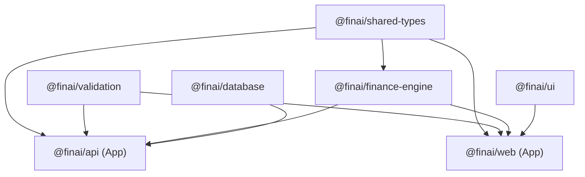

# FinAI Windows Server & Docker Management Guide

Welcome to the official DevOps engineering, Docker containerization, reverse proxying, and database management guide for the **FinAI** monorepo on **Windows Server** host path:

```text
D:\server\repos\fin-ai
```

---

## 📂 Host Directory Layout (`D:\server\`)

```text
D:\
└── server\
    ├── repos\
    │   └── fin-ai\                  # Application Source Repository
    │       ├── apps\                # Next.js frontend & NestJS API
    │       ├── packages\            # Monorepo packages (db, ui, finance-engine)
    │       ├── docker\              # Container Dockerfiles & Nginx configs
    │       ├── scripts\             # PowerShell deployment, backup & restore scripts
    │       ├── docker-compose.yml   # Production container orchestration
    │       ├── package.json
    │       └── .env                 # Production secrets file
    │
    ├── docker-data\                 # Persistent Container State
    │   ├── postgres\                # Host-mounted PostgreSQL data
    │   └── nginx\                   # Host-mounted SSL/TLS certificates
    │
    ├── storage\                     # Persistent Storage
    │   ├── uploads\                 # User uploaded document attachments
    │   └── exports\                 # Generated CSV/PDF financial reports
    │
    ├── logs\                        # Host Log Aggregation
    │   ├── nginx\                   # Web server access & error logs
    │   ├── api\                     # NestJS application logs
    │   └── web\                     # Next.js server component logs
    │
    └── backups\                     # Automated Storage & Database Backups
        └── postgres\                # Compressed .sql.zip database dumps
```

---

# Module 1 — Monorepo Build Graph

A modern TypeScript monorepo managed via **pnpm workspaces** and **Turbo**:



---

# Module 2 — Dockerize API (`@finai/api`)

The API Dockerfile (`docker/api/Dockerfile`) uses a 3-stage build pattern (`base` -> `builder` -> `runner`):

```dockerfile
FROM node:24-alpine AS base
ENV PNPM_HOME="/pnpm"
ENV PATH="$PNPM_HOME:$PATH"
RUN corepack enable && corepack prepare pnpm@11.13.0 --activate
RUN apk add --no-cache openssl libc6-compat dumb-init

FROM base AS builder
WORKDIR /app
COPY package.json pnpm-lock.yaml pnpm-workspace.yaml turbo.json tsconfig.base.json tsconfig.json ./
COPY packages ./packages
COPY apps/api ./apps/api
RUN --mount=type=cache,id=pnpm,target=/pnpm/store pnpm install --frozen-lockfile
RUN pnpm --filter @finai/database db:generate
RUN pnpm --filter @finai/api... build
RUN pnpm --filter @finai/api deploy --prod --legacy /app/pruned
RUN cp -R packages/database/node_modules/.prisma /app/pruned/node_modules/ 2>/dev/null || true
RUN cp -R packages/database/node_modules/@prisma /app/pruned/node_modules/ 2>/dev/null || true

FROM base AS runner
WORKDIR /app
ENV NODE_ENV=production
ENV PORT=4000
RUN addgroup --system --gid 1001 nodejs && adduser --system --uid 1001 nestjs
COPY --from=builder --chown=nestjs:nodejs /app/pruned ./
USER nestjs
EXPOSE 4000
HEALTHCHECK --interval=30s --timeout=5s --start-period=15s --retries=3 \
  CMD wget --no-verbose --tries=1 --spider http://localhost:4000/api/health || exit 1
ENTRYPOINT ["dumb-init", "--"]
CMD ["node", "dist/main.js"]
```

Key Architectural Principles:

- **`dumb-init`**: Acts as PID 1, handling signal forwarding (`SIGTERM`, `SIGINT`) for graceful shutdown.
- **Non-Root User (`nestjs`)**: Restricts container privileges to UID 1001.

---

# Module 3 — Dockerize Web (`@finai/web`)

The Web Dockerfile (`docker/web/Dockerfile`) leverages Next.js `output: "standalone"`:

```dockerfile
FROM node:24-alpine AS base
ENV PNPM_HOME="/pnpm"
ENV PATH="$PNPM_HOME:$PATH"
RUN corepack enable && corepack prepare pnpm@11.13.0 --activate
RUN apk add --no-cache dumb-init

FROM base AS builder
WORKDIR /app
COPY package.json pnpm-lock.yaml pnpm-workspace.yaml turbo.json tsconfig.base.json tsconfig.json ./
COPY packages ./packages
COPY apps/web ./apps/web
RUN mkdir -p apps/web/public
RUN --mount=type=cache,id=pnpm,target=/pnpm/store pnpm install --frozen-lockfile
ENV NEXT_TELEMETRY_DISABLED=1
ENV NODE_ENV=production
RUN pnpm --filter @finai/web... build

FROM base AS runner
WORKDIR /app
ENV NODE_ENV=production
ENV PORT=3000
ENV HOSTNAME="0.0.0.0"
ENV NEXT_TELEMETRY_DISABLED=1
RUN addgroup --system --gid 1001 nodejs && adduser --system --uid 1001 nextjs
COPY --from=builder /app/apps/web/public ./apps/web/public
COPY --from=builder --chown=nextjs:nodejs /app/apps/web/.next/standalone ./
COPY --from=builder --chown=nextjs:nodejs /app/apps/web/.next/static ./apps/web/.next/static
USER nextjs
EXPOSE 3000
HEALTHCHECK --interval=30s --timeout=5s --start-period=15s --retries=3 \
  CMD wget --no-verbose --tries=1 --spider http://localhost:3000/ || exit 1
ENTRYPOINT ["dumb-init", "--"]
CMD ["node", "apps/web/server.js"]
```

---

# Module 4 — Docker Networking & Host-Native Ollama

1. **Embedded DNS Service Discovery**:
   - `api` connects to PostgreSQL via `postgres:5432`
   - `nginx` routes traffic to `web:3000` and `api:4000`

2. **Native Windows Ollama Routing**:
   The NestJS API container connects to native Windows Ollama using host gateway DNS:
   ```text
   http://host.docker.internal:11434
   ```

---

# Module 5 — Nginx Reverse Proxy Architecture

Nginx handles edge gateway routing on Ports `80` & `443`:

- `http://localhost/` -> Proxies to `fin-ai-web` (`web:3000`)
- `http://localhost/api/` -> Proxies to `fin-ai-api` (`api:4000`)

---

# Module 6 — Standard Pure Docker Compose Commands

Run pure, native `docker compose` commands in your terminal:

### 1. Build & Start All Containers

```bash
docker compose up -d --build
```

### 2. View Real-Time Streaming Logs

```bash
docker compose logs -f
```

### 3. Check Container Health Status

```bash
docker compose ps
```

### 4. Stop Stack Safely

```bash
docker compose down
```

---

# Module 7 — Database Backup & Restoration

### Backup Database

```powershell
powershell -ExecutionPolicy Bypass -File .\scripts\backup-postgres.ps1
```

Dumps PostgreSQL database to a timestamped archive: `D:\server\backups\postgres\finai_db_YYYY-MM-DD_HH-MM-SS.sql.zip`.

### Restore Database

```powershell
powershell -ExecutionPolicy Bypass -File .\scripts\restore-postgres.ps1 -BackupZipFile "D:\server\backups\postgres\finai_db_2026-07-20_12-00-00.sql.zip"
```

---

# Module 8 — Daily Operations & Monitoring Cheat Sheet

```powershell
# View running status of containers
docker compose ps

# View container CPU, RAM, and Network usage
docker stats

# Stream logs from all containers
docker compose logs -f

# Stream logs from NestJS API only
docker compose logs -f api

# Safely stop containers without deleting data
docker compose down

# Rebuild containers after code changes
docker compose up -d --build
```
