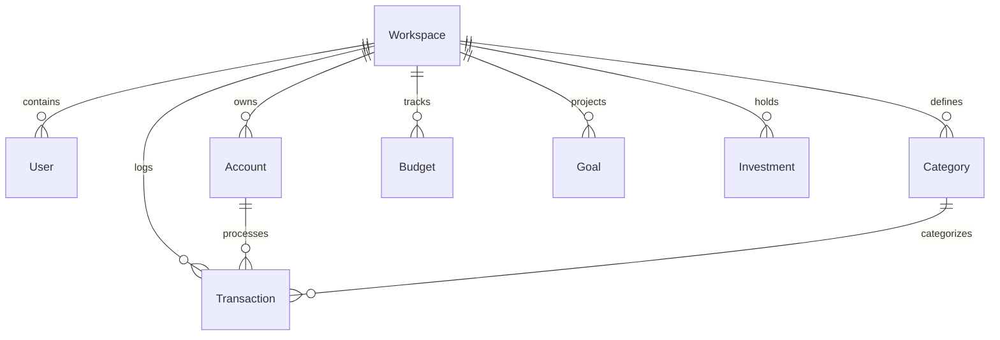

# @finai/database

`@finai/database` manages the PostgreSQL schema definitions, Prisma ORM Client generation, database migration scripts, and seed data for the FinAI ecosystem.

---

## Prisma Data Schema & Models

The Prisma schema is defined in `prisma/schema.prisma`.



### Core Entities

- **Workspace**: Multi-tenant isolation container for financial records.
- **User**: User credentials and workspace access controls.
- **Account**: Financial accounts (Bank, Credit Card, Digital Wallet, Cash).
- **Transaction**: Income, expense, and transfer records with amounts, dates, and category tags.
- **Category**: Custom spending and income classifications.
- **Budget**: Spending caps assigned to categories with period tracking.
- **Investment**: Stock, mutual fund, crypto, or real estate assets with buy price and current valuation.
- **Goal**: Target savings goals with target date and monthly contribution targets.

---

## Workspace Scripts

```bash
# Generate Prisma Client (.prisma/client)
pnpm db:generate

# Create and apply new Prisma migrations (Development)
pnpm db:migrate

# Seed database with sample accounts, budgets, and transactions
pnpm db:seed

# Validate Prisma schema syntax
pnpm --filter @finai/database db:validate
```

---

## Production Deployment & Migration Workflow

During production deployments via Docker Compose or PowerShell scripts (`deploy.ps1`), migrations are automatically run before restarting the API service:

```bash
docker compose run --rm api pnpm db:migrate
```
